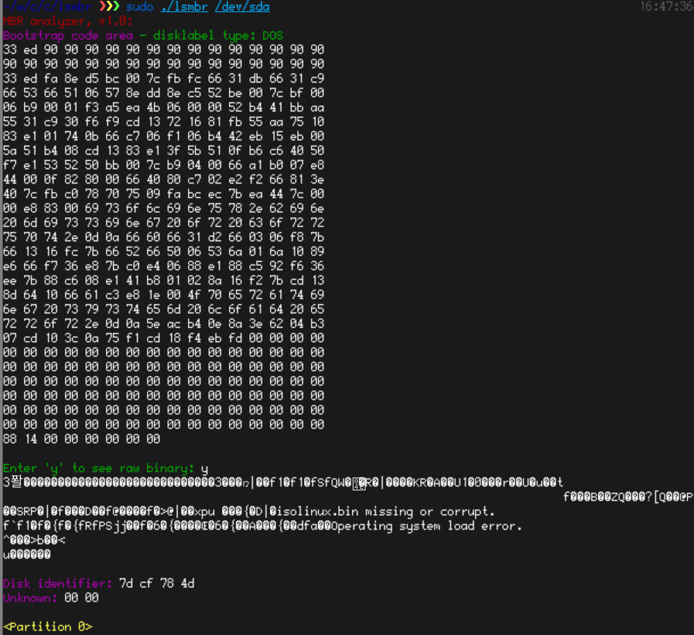
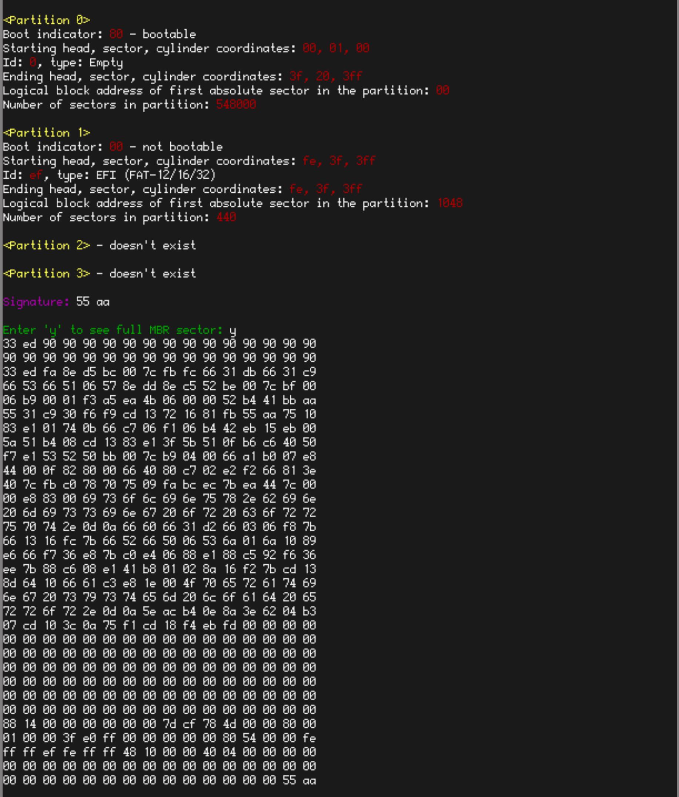
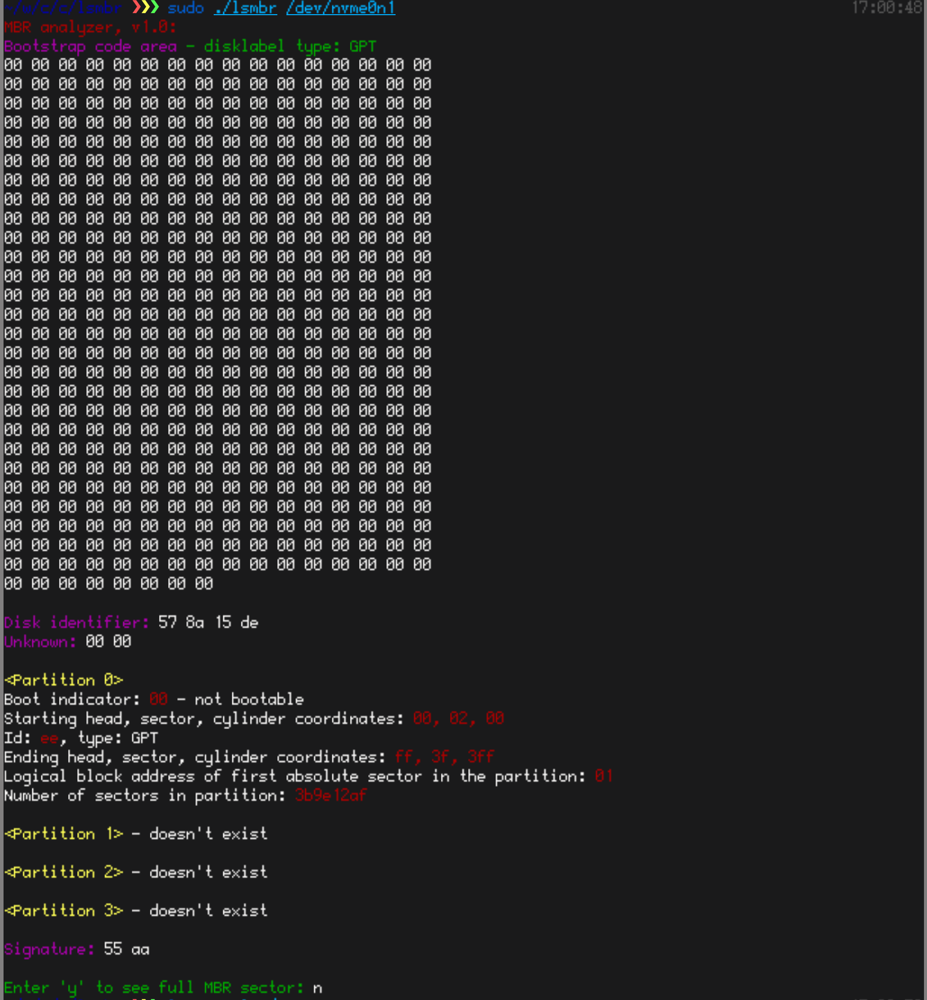

This linux-compatible console tool displays MBR contents

Run this as a root user, or a member of `disk` group

# Installation

```
git clone https://github.com/sekvanto/lsmbr/
cd lsmbr
gcc -Wall lsmbr.c -o lsmbr
```

# Usage

```
sudo ./lsmbr <disk>
```

# Examples

This tool reads first 512 bytes on a specified disk, then analyzes it and outputs detailed info.

Example on dos-labeled disk:



Gpt-labeled disk:
